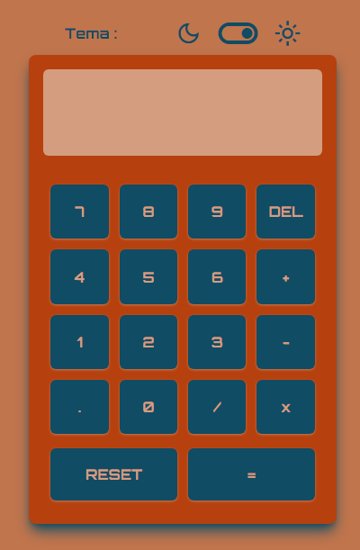
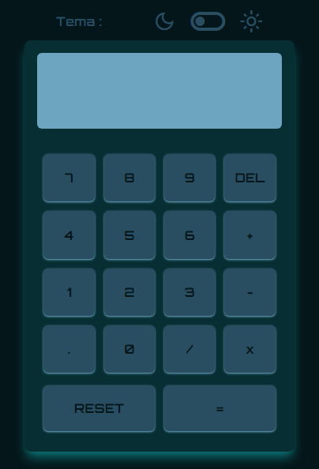

# Calculadora

## Descrição

Uma calculadora simples com as operações básicas e suporte a modos light e dark.

---

## 🚀 Como Começar

1. Clone este repositório.
2. Execute `npm install` para instalar as dependências.
3. Execute `npm run serve` para iniciar o aplicativo localmente.

### Uso

Digite os números, escolha a operação desejada e pressione Enter.

---

## 🤝 Contribuindo

Se desejar contribuir para este projeto, siga estas etapas:

1. Fork este repositório.
2. Crie uma branch com a sua funcionalidade: `git checkout -b minha-funcionalidade`.
3. Faça commit das suas mudanças: `git commit -m 'Adicionar nova funcionalidade'`.
4. Envie para a branch principal do seu fork: `git push origin minha-funcionalidade`.
5. Abra um pull request descrevendo as mudanças propostas.

---

##  Imagens

---

## 📝 Licença

Este projeto está licenciado sob a Licença MIT - veja o arquivo [LICENSE](LICENSE) para detalhes.

---

## 📬 Contato

- E-mail: guuhnog@gmail.com
- Linkedin: [Gustavo Nogueira](https://www.linkedin.com/in/gustavo-henrique-nogueira-deranzani-bicudo-11659a221/)

---

**Desenvolvido por Gustavo Nogueira**

